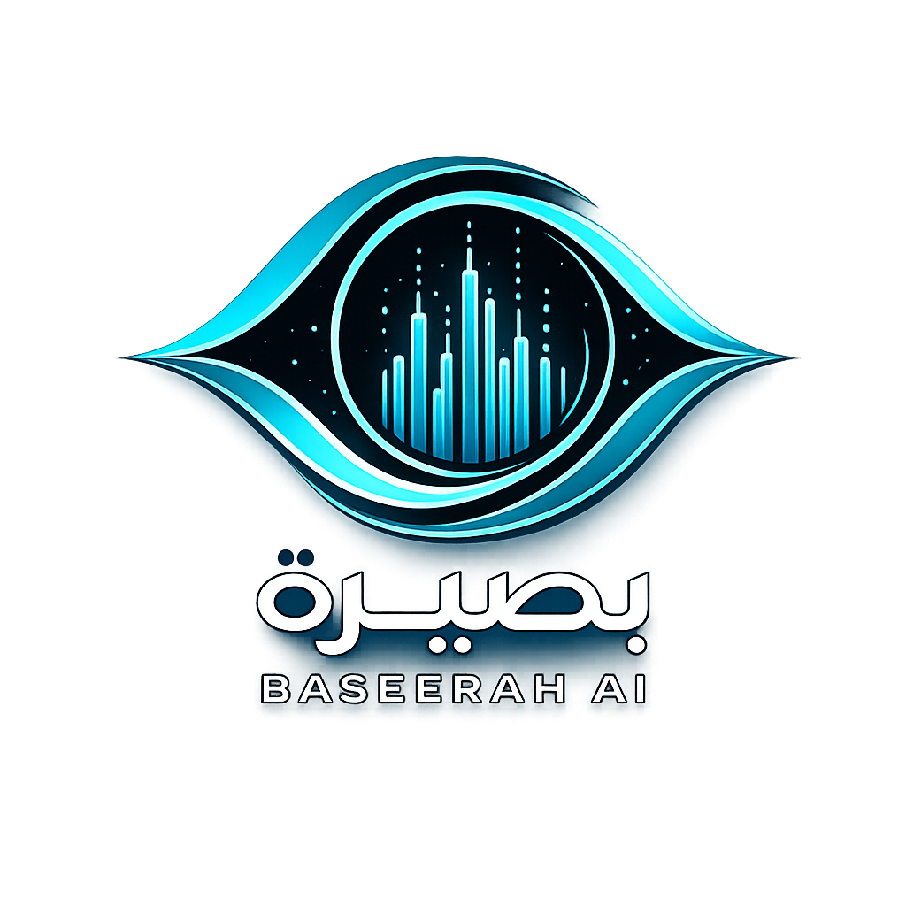
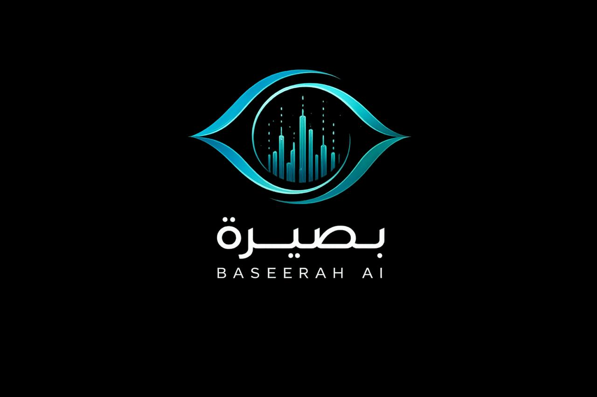
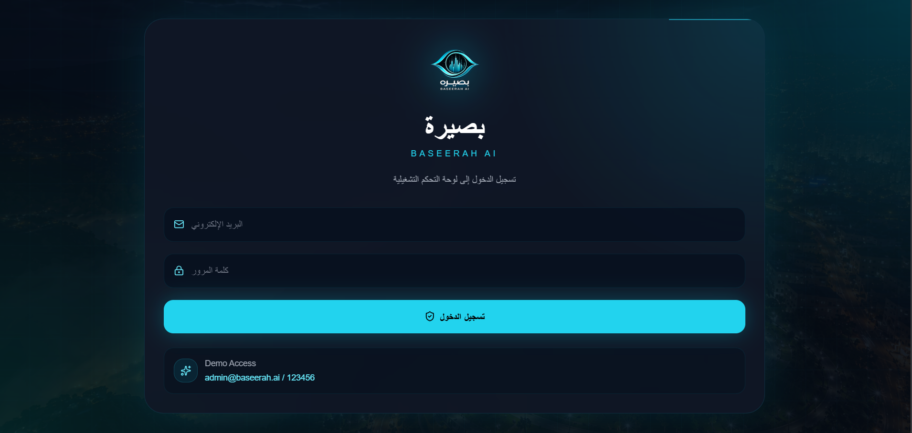
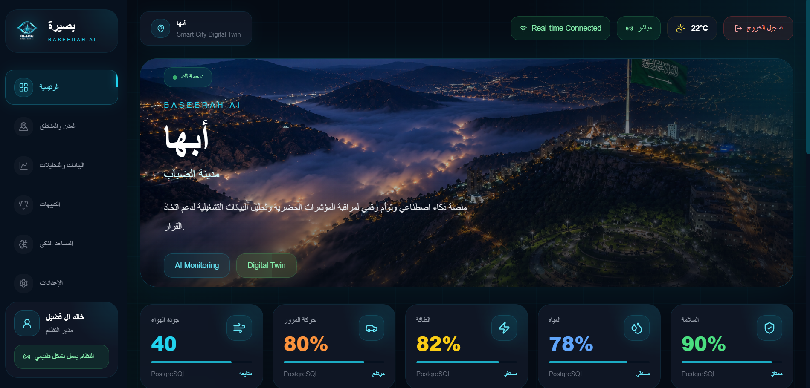
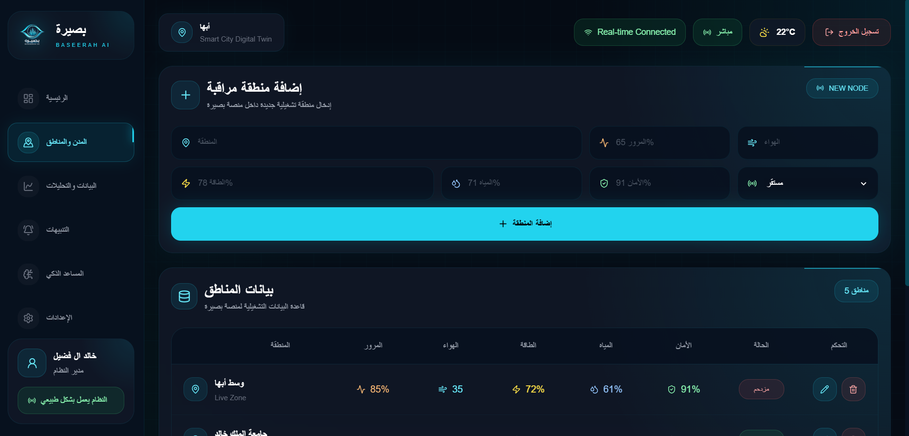
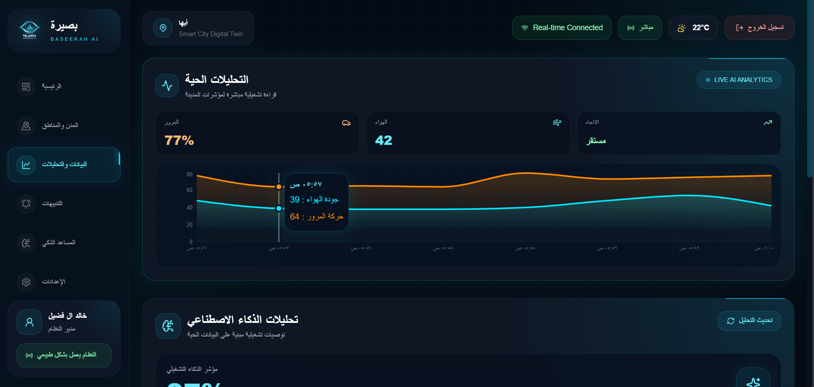
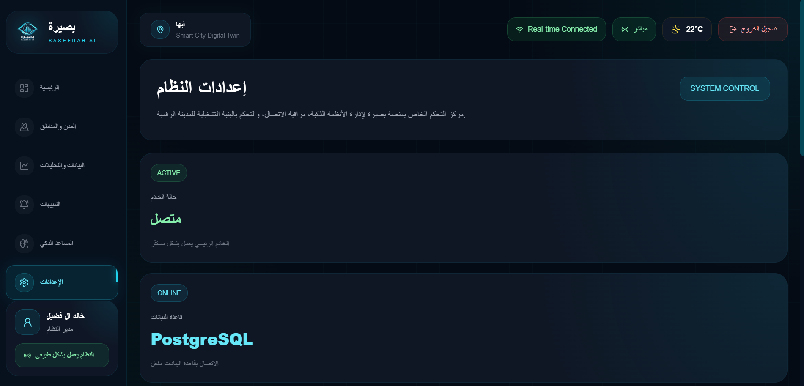
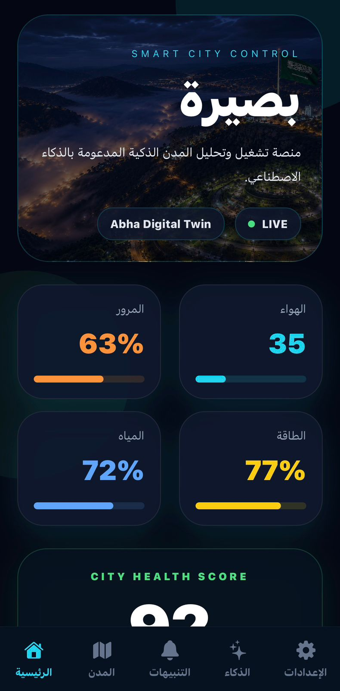
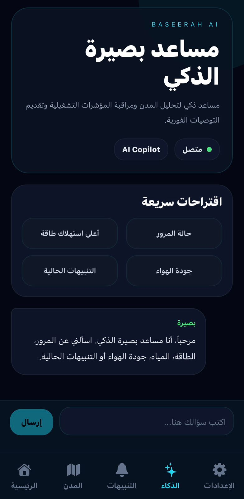

<div align="center">



# بصيرة | Baseerah AI

### Smart City Digital Twin Platform Powered by Artificial Intelligence

A smart city platform designed to monitor, analyze, and visualize urban operational indicators in real time using Artificial Intelligence, Live Analytics, and Digital Twin technologies.

---


</div>

---

# Overview

Baseerah AI is an intelligent smart-city management platform developed as a Computer Science graduation project.

The system acts as a Digital Twin for cities by collecting, visualizing, and analyzing operational indicators such as:

- Air Quality
- Traffic Flow
- Energy Consumption
- Water Usage
- Public Safety
- Live Operational Events

The platform provides decision-makers with a unified dashboard and AI-powered recommendations for improved city management.

---

# Key Features

## Smart City Digital Twin

Monitor city-wide operational indicators through a centralized control center.

## Real-Time Monitoring

Live updates using Socket.IO technology.

## AI Assistant

Baseerah AI Copilot provides intelligent operational recommendations.

## Live Analytics

Interactive visualizations and real-time trend analysis.

## Alerts & Notifications

Instant alerts for abnormal operational conditions.

## City Health Score

Overall performance scoring for monitored regions.

## Multi-Region Management

Manage cities, districts, and monitored zones.

## Mobile Application

Cross-platform mobile application built using React Native and Expo.

---

# System Screenshots

## Project Identity



---

## Secure Login System



Role-based authentication system for accessing the platform.

---

## Smart City Dashboard



Real-time city monitoring and operational analytics.

---

## City & Region Management



Manage operational zones and monitored regions.

---

## Live Analytics



Interactive charts and operational trend visualization.

---

## System Administration



Monitor infrastructure, database connectivity, and system health.

---

# Mobile Application

## Mobile Dashboard



Monitor city indicators directly from mobile devices.

---

## Baseerah AI Copilot



AI-powered assistant capable of analyzing operational indicators and generating recommendations.

---

# Technology Stack

## Frontend

- React.js
- Vite
- Tailwind CSS
- Recharts

## Backend

- Node.js
- Express.js
- Socket.IO

## Database

- PostgreSQL

## Mobile

- React Native
- Expo

## Development Tools

- Git
- GitHub
- VS Code
- pgAdmin

---

# Architecture

```text
Mobile App
      │
      ▼
 React Frontend
      │
      ▼
 Express Backend
      │
      ▼
 PostgreSQL Database
      │
      ▼
 AI Analysis Engine
```

# Future Enhancements

- AI Predictive Analytics
- Traffic Forecasting
- Water Consumption Forecasting
- Energy Optimization
- Smart Alerts Engine
- IoT Sensor Integration
- Vision 2030 Smart City Expansion
- Cloud Deployment

# Project Objectives

- Build a Digital Twin for smart city monitoring.
- Improve operational decision-making.
- Integrate Artificial Intelligence into city management.
- Provide real-time analytics and alerts.
- Support future smart-city initiatives.

# Author

**Khalid Yahya AlFudhayl**

Computer Science Student  
King Khalid University

Graduation Project (2026–2027)

GitHub:
https://github.com/Khalid-AlFudhayl

---

# Baseerah AI

### See the city. Understand the city. Improve the city.